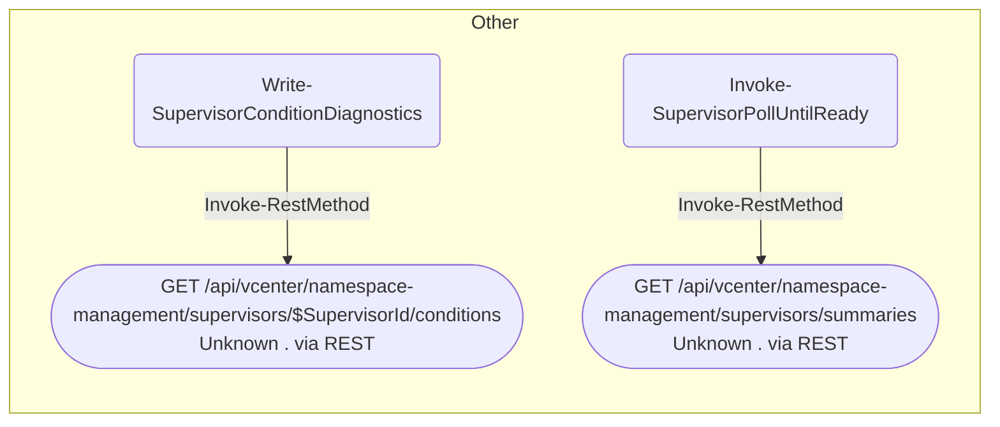

# API graph - VcfEdgeAtScale.psm1

Generated on **2026-06-04 17:16:57 -04:00** by `internalTools/VcfScriptApiMap/New-VcfScriptApiGraph.ps1`. Regenerate at any time:

```powershell
..\internalTools\VcfScriptApiMap\New-VcfScriptApiGraph.ps1 -Path "VcfEdgeAtScale.psm1"
```

Sources analyzed:

- `VcfEdgeAtScale.psm1` (`/Users/nthaler/git/pwsh-vcf-sa/VcfEdgeAtScale/VcfEdgeAtScale.psm1`)

Auto-discovered via dot-source:

- `Logging.ps1` (`/Users/nthaler/git/pwsh-vcf-sa/VcfEdgeAtScale/Private/Logging.ps1`)
- `Cluster.ps1` (`/Users/nthaler/git/pwsh-vcf-sa/VcfEdgeAtScale/Private/Cluster.ps1`)
- `Networking.ps1` (`/Users/nthaler/git/pwsh-vcf-sa/VcfEdgeAtScale/Private/Networking.ps1`)
- `Supervisor.ps1` (`/Users/nthaler/git/pwsh-vcf-sa/VcfEdgeAtScale/Private/Supervisor.ps1`)
- `Yaml.ps1` (`/Users/nthaler/git/pwsh-vcf-sa/VcfEdgeAtScale/Private/Yaml.ps1`)
- `Validation.ps1` (`/Users/nthaler/git/pwsh-vcf-sa/VcfEdgeAtScale/Private/Validation.ps1`)
- `Deployment.ps1` (`/Users/nthaler/git/pwsh-vcf-sa/VcfEdgeAtScale/Private/Deployment.ps1`)
- `EntryPoints.ps1` (`/Users/nthaler/git/pwsh-vcf-sa/VcfEdgeAtScale/Private/EntryPoints.ps1`)

## Legend

- A node labeled `METHOD /path` is an HTTP endpoint. The second line of the label is `<Public|Internal> . <via SDK|via REST>`.
- A third label line (for example `VCF 9.0.x only`, `VCF 9.0–9.0.x`, `VCF 9.1+`) is rendered only when the API map declares the endpoint is *version-gated* (i.e. has a `MaxVcfVersion`). Endpoints that are simply available from the script's minimum VCF release upward skip the third line to keep the overview flowchart readable; their applicability is still surfaced in the **VCF release** column of the endpoints table below.
- SDK cmdlets are translated to their underlying HTTP endpoint; the specific cmdlet name appears on the edge into that endpoint, so two SDK cmdlets that call the same endpoint are both visible as separate edges.
- REST calls (project wrappers over `Invoke-RestMethod`) use the URL observed at the call site; the wrapper name appears on the edge.
- Local cmdlets (for example `Initialize-*` payload builders, client-side `Disconnect-*`) do not issue HTTP requests and are not rendered in the graph.

## Summary

| Metric | Count |
|---|---:|
| Call sites analyzed | 123 |
| Call sites mapped to an endpoint | 54 |
| Distinct endpoints | 28 |
| VCF-version-gated endpoints (max release set) | 0 |
| SDK cmdlet calls | 48 |
| REST calls | 6 |
| Public-endpoint calls | 52 |
| Internal-endpoint calls | 0 |
| Local (no HTTP) cmdlet calls | 69 |

### By target system

| Target system | Call sites | Distinct endpoints |
|---|---:|---:|
| Other | 2 | 2 |
| vCenter | 52 | 26 |

## Overview

```mermaid
flowchart LR
    sc1("VcfEdgeAtScale.psm1")
    ts1[("Other")]
    sc1 --> ts1
    ep1(["GET /api/vcenter/namespace-management/supervisors/$SupervisorId/conditions<br/>Unknown . via REST"])
    ts1 --> ep1
    ep2(["GET /api/vcenter/namespace-management/supervisors/summaries<br/>Unknown . via REST"])
    ts1 --> ep2
    ts2[("vCenter")]
    sc1 --> ts2
    ep3(["DELETE /rest/com/vmware/cis/session<br/>Public . via REST"])
    ts2 --> ep3
    ep4(["DELETE /vcenter/namespace-management/supervisors/{supervisor}/container-image-registries/{containerImageRegistry}<br/>Public . via SDK"])
    ts2 --> ep4
    ep5(["DELETE /vcenter/namespace-management/supervisors/{supervisor}/supervisor-services/{supervisorService}<br/>Public . via SDK"])
    ts2 --> ep5
    ep6(["DELETE /vcenter/namespaces/instances/{namespace}<br/>Public . via SDK"])
    ts2 --> ep6
    ep7(["GET /api/vcenter/namespace-management/supervisors/summaries<br/>Public . via REST"])
    ts2 --> ep7
    ep8(["GET /esx/settings/repository/software<br/>Public . via SDK"])
    ts2 --> ep8
    ep9(["GET /vcenter/namespace-management/clusters<br/>Public . via SDK"])
    ts2 --> ep9
    ep10(["GET /vcenter/namespace-management/lifecycle/content/libraries<br/>Public . via SDK"])
    ts2 --> ep10
    ep11(["GET /vcenter/namespace-management/software/clusters<br/>Public . via SDK"])
    ts2 --> ep11
    ep12(["GET /vcenter/namespace-management/software/clusters/{cluster}<br/>Public . via SDK"])
    ts2 --> ep12
    ep13(["GET /vcenter/namespace-management/supervisors/{supervisor}/conditions<br/>Public . via SDK"])
    ts2 --> ep13
    ep14(["GET /vcenter/namespace-management/supervisors/{supervisor}/container-image-registries<br/>Public . via SDK"])
    ts2 --> ep14
    ep15(["GET /vcenter/namespace-management/supervisors/{supervisor}/summary<br/>Public . via SDK"])
    ts2 --> ep15
    ep16(["GET /vcenter/namespace-management/supervisors/{supervisor}/supervisor-services/{supervisorService}<br/>Public . via SDK"])
    ts2 --> ep16
    ep17(["GET /vcenter/namespace-management/virtual-machine-classes<br/>Public . via SDK"])
    ts2 --> ep17
    ep18(["GET /vcenter/namespaces/instances<br/>Public . via SDK"])
    ts2 --> ep18
    ep19(["POST /rest/com/vmware/cis/session<br/>Public . via REST"])
    ts2 --> ep19
    ep20(["POST /vcenter/namespace-management/clusters/{cluster}?action=disable<br/>Public . via SDK"])
    ts2 --> ep20
    ep21(["POST /vcenter/namespace-management/software/clusters/{cluster}?action=upgrade<br/>Public . via SDK"])
    ts2 --> ep21
    ep22(["POST /vcenter/namespace-management/supervisor-services<br/>Public . via SDK"])
    ts2 --> ep22
    ep23(["POST /vcenter/namespace-management/supervisors/{cluster}?action=enable_on_compute_cluster<br/>Public . via SDK"])
    ts2 --> ep23
    ep24(["POST /vcenter/namespace-management/supervisors/{supervisor}/container-image-registries<br/>Public . via SDK"])
    ts2 --> ep24
    ep25(["POST /vcenter/namespace-management/supervisors/{supervisor}/supervisor-services<br/>Public . via SDK"])
    ts2 --> ep25
    ep26(["POST /vcenter/namespaces/instances/v2<br/>Public . via SDK"])
    ts2 --> ep26
    ep27(["PUT /vcenter/namespace-management/lifecycle/content/libraries<br/>Public . via SDK"])
    ts2 --> ep27
    ep28(["PUT /vcenter/namespaces/instances/{namespace}<br/>Public . via SDK"])
    ts2 --> ep28
```



## Per target system

### Other



### vCenter


## Endpoints

| Target system | Method | Path | Visibility | Implementation | VCF release | Cmdlets | Call sites |
|---|---|---|---|---|---|---|---:|
| Other | GET | `/api/vcenter/namespace-management/supervisors/$SupervisorId/conditions` | Unknown | via REST | - | `Invoke-RestMethod` | 1 |
| Other | GET | `/api/vcenter/namespace-management/supervisors/summaries` | Unknown | via REST | - | `Invoke-RestMethod` | 1 |
| vCenter | GET | `/api/vcenter/namespace-management/supervisors/summaries` | Public | via REST | - | `Invoke-RestMethod, Find-SupervisorByName` | 2 |
| vCenter | GET | `/esx/settings/repository/software` | Public | via SDK | - | `Invoke-EsxSettingsRepositorySoftwareList` | 1 |
| vCenter | DELETE | `/rest/com/vmware/cis/session` | Public | via REST | - | `Invoke-RestMethod` | 1 |
| vCenter | POST | `/rest/com/vmware/cis/session` | Public | via REST | - | `New-VCenterRestApiSession` | 1 |
| vCenter | POST | `/vcenter/namespace-management/clusters/{cluster}?action=disable` | Public | via SDK | - | `Invoke-DisableCluster` | 1 |
| vCenter | GET | `/vcenter/namespace-management/clusters` | Public | via SDK | - | `Invoke-ListNamespaceManagementClusters` | 3 |
| vCenter | GET | `/vcenter/namespace-management/lifecycle/content/libraries` | Public | via SDK | - | `Invoke-VcenterNamespaceManagementLifecycleContentLibrariesList` | 1 |
| vCenter | PUT | `/vcenter/namespace-management/lifecycle/content/libraries` | Public | via SDK | - | `Invoke-VcenterNamespaceManagementLifecycleContentLibrariesSet` | 1 |
| vCenter | POST | `/vcenter/namespace-management/software/clusters/{cluster}?action=upgrade` | Public | via SDK | - | `Invoke-UpgradeCluster` | 1 |
| vCenter | GET | `/vcenter/namespace-management/software/clusters/{cluster}` | Public | via SDK | - | `Invoke-GetClusterNamespaceManagementSoftware` | 1 |
| vCenter | GET | `/vcenter/namespace-management/software/clusters` | Public | via SDK | - | `Invoke-ListNamespaceManagementSoftwareClusters` | 3 |
| vCenter | POST | `/vcenter/namespace-management/supervisor-services` | Public | via SDK | - | `Invoke-CreateNamespaceManagementSupervisorServices` | 2 |
| vCenter | POST | `/vcenter/namespace-management/supervisors/{cluster}?action=enable_on_compute_cluster` | Public | via SDK | - | `Invoke-EnableOnComputeClusterClusterSupervisors` | 1 |
| vCenter | GET | `/vcenter/namespace-management/supervisors/{supervisor}/conditions` | Public | via SDK | - | `Invoke-GetSupervisorNamespaceManagementConditions` | 2 |
| vCenter | DELETE | `/vcenter/namespace-management/supervisors/{supervisor}/container-image-registries/{containerImageRegistry}` | Public | via SDK | - | `Invoke-DeleteSupervisorContainerImageRegistryNamespaceManagementContainerImageRegistries` | 2 |
| vCenter | GET | `/vcenter/namespace-management/supervisors/{supervisor}/container-image-registries` | Public | via SDK | - | `Invoke-ListSupervisorNamespaceManagementContainerImageRegistries` | 2 |
| vCenter | POST | `/vcenter/namespace-management/supervisors/{supervisor}/container-image-registries` | Public | via SDK | - | `Invoke-CreateSupervisorNamespaceManagementContainerImageRegistries` | 1 |
| vCenter | GET | `/vcenter/namespace-management/supervisors/{supervisor}/summary` | Public | via SDK | - | `Invoke-GetSupervisorNamespaceManagementSummary` | 3 |
| vCenter | DELETE | `/vcenter/namespace-management/supervisors/{supervisor}/supervisor-services/{supervisorService}` | Public | via SDK | - | `Invoke-VcenterNamespaceManagementSupervisorsSupervisorServicesDelete` | 1 |
| vCenter | GET | `/vcenter/namespace-management/supervisors/{supervisor}/supervisor-services/{supervisorService}` | Public | via SDK | - | `Invoke-VcenterNamespaceManagementSupervisorsSupervisorServicesGet` | 6 |
| vCenter | POST | `/vcenter/namespace-management/supervisors/{supervisor}/supervisor-services` | Public | via SDK | - | `Invoke-VcenterNamespaceManagementSupervisorsSupervisorServicesCreate` | 2 |
| vCenter | GET | `/vcenter/namespace-management/virtual-machine-classes` | Public | via SDK | - | `Invoke-ListNamespaceManagementVirtualMachineClasses` | 1 |
| vCenter | DELETE | `/vcenter/namespaces/instances/{namespace}` | Public | via SDK | - | `Invoke-DeleteNamespaceInstances` | 3 |
| vCenter | PUT | `/vcenter/namespaces/instances/{namespace}` | Public | via SDK | - | `Invoke-SetNamespaceInstances` | 1 |
| vCenter | POST | `/vcenter/namespaces/instances/v2` | Public | via SDK | - | `Invoke-CreateNamespacesInstancesV2` | 1 |
| vCenter | GET | `/vcenter/namespaces/instances` | Public | via SDK | - | `Invoke-ListNamespacesInstances` | 8 |

## VCF version applicability

_No endpoints in this graph are gated to a specific VCF release range (no `MaxVcfVersion` declared in the API map)._

